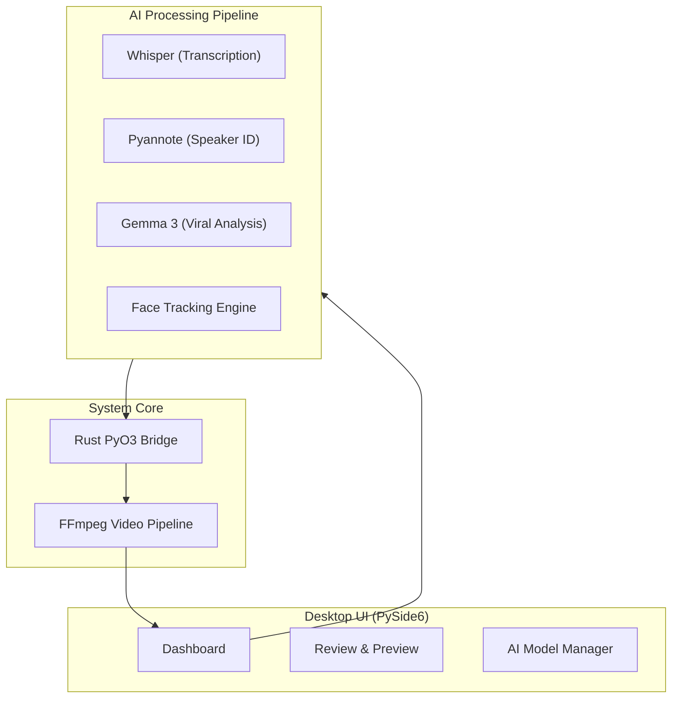
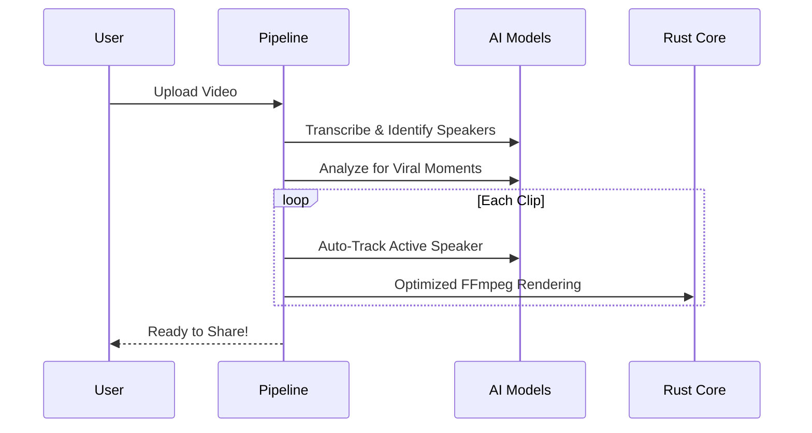

# clipperr 🚀

**AI-Powered Viral Video Clipper.**  
Cut long-form videos into viral short-form clips (TikTok/Reels/Shorts) with **automatic face tracking**, **speaker diarization**, and **AI-driven viral analysis**—all running locally on your hardware.

---

## 🌌 Why clipperr?

*   **🔒 Privacy First**: Your videos stay on your machine. No cloud uploads required.
*   **💰 Zero Cost**: High-end AI processing without monthly subscription fees.
*   **🤖 Intelligent Focus**: Automatically keeps the active speaker centered using advanced face tracking and speaker diarization.
*   **⚡ High Performance**: Ultra-fast rendering engine powered by **Rust** and **FFmpeg**.

---

## 🛠️ Architecture

clipperr combines a modern Python/PySide6 frontend with a high-performance Rust core engine.



---

## 🚀 Getting Started

### 📦 Windows (Recommended)
1. Download the latest **[Windows Release](https://github.com/rasyiqi-code/clipperr/releases)** (`clipperr-windows-v1.0.zip`).
2. Extract the folder and run `clipperr.exe`.
3. Go to **Settings** ⚙️ and paste your **HuggingFace Access Token**.
4. Start clipping!

### 🐧 Linux (From Source)
Ensure you have `ffmpeg` and `python 3.12+` installed.
```bash
git clone https://github.com/rasyiqi-code/clipperr.git
cd clipperr
pip install -r requirements.txt
python3 app/main.py
```

---

## 🧬 Technical Flow



---

## ⚙️ Requirements
*   **OS**: Windows 10+ or Modern Linux.
*   **RAM**: 8GB Minimum (16GB+ recommended for faster processing and stability).
*   **GPU**: NVIDIA GPU (Optional, for 5x faster processing).
*   **Disk**: ~5GB free space for AI models.

---

## 📄 License
MIT License - Developed for creators who value privacy and power.
