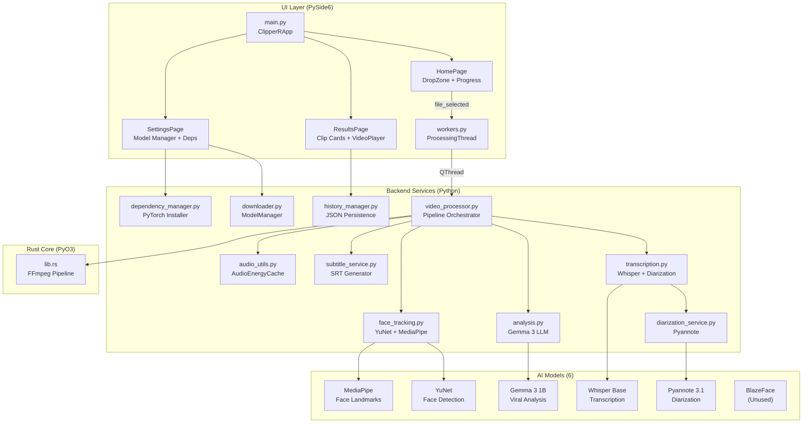
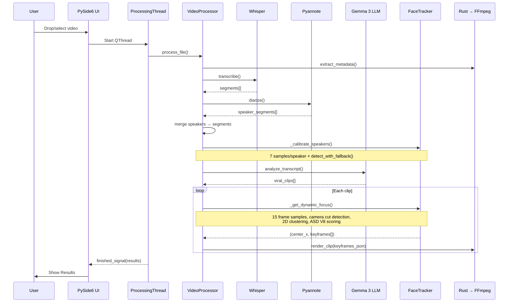

# Deep Analysis: ClipperR Codebase

## 1. Architecture Overview

---

## 2. File-by-File Analysis

### 2.1 Pipeline Core

#### [video_processor.py](file:///home/rasyiqi/Project/clipperr/app/services/video_processor.py) — 639 lines
**Role:** Pipeline orchestrator. Urutan: metadata → transcription → diarization → calibration → LLM analysis → face tracking → rendering.

| Aspek | Detail |
|-------|--------|
| **Strengths** | Modular pipeline, cancel support, speaker memory, camera cut detection, dynamic panning |
| **Complexity** | Sangat tinggi — 639 lines single-class dengan 12+ methods |

> [!WARNING]
> **Issue VP-1: God Class**
> `VideoProcessor` melakukan terlalu banyak: sampling, clustering, scoring, camera cut detection, temporal smoothing, memory fallback, dan rendering orchestration. Seharusnya di-split ke `FocusEngine` class yang terpisah.

> [!WARNING]
> **Issue VP-2: Duplicate logic di `_get_dynamic_focus` dan `_get_robust_face_center`**
> Kedua method melakukan Phase 1-3 yang sama persis (sample frames, detect cuts, cluster). `_get_robust_face_center` seharusnya cukup memanggil `_get_dynamic_focus` dan return `center_x` saja.

> [!CAUTION]
> **Issue VP-3: VideoCapture leak pada exception**
> Di `_get_dynamic_focus` dan `_get_robust_face_center`, jika `cv2.VideoCapture()` succeed tapi `preload()` throws sebelum `try` block, `cap` tidak di-release. Perlu context manager.

> [!NOTE]
> **Issue VP-4: `_calibrate_speakers` masih pakai legacy `get_audio_energy`**
> Calibration masih spawn FFmpeg subprocess per-sample, bukan menggunakan `AudioEnergyCache`. Comment di kode mengatakan "batch cache not worth it here" tapi dengan 7 samples × N speakers, ini bisa masih 20+ subprocess calls.

---

#### [face_tracking.py](file:///home/rasyiqi/Project/clipperr/app/services/face_tracking.py) — 266 lines
**Role:** Face detection + validation + scene classification.

| Aspek | Detail |
|-------|--------|
| **Strengths** | Two-pass detection, scene classifier, critical landmark validation |
| **Detection Chain** | YuNet → aspect filter → Y-gate → min area → landmark match → critical landmarks → unconfirmed score gate |

> [!WARNING]
> **Issue FT-1: `detect_with_fallback` bisa run detection 3x per frame**
> Pass 1 (strict) → classify_scene → re-detect with adaptive params → Pass 2 (relaxed if needed). Worst case: 3× YuNet + 3× MediaPipe per frame. Ini **sangat mahal** di CPU.

> [!NOTE]
> **Issue FT-2: Scene classifier over-generalizes**
> `classify_scene` bergantung sepenuhnya pada `avg_area` dan `face_count` dari deteksi inisial. Tapi deteksi inisial bisa salah (miss faces) → scene classification salah → adaptive params salah → cascading error.

> [!NOTE]
> **Issue FT-3: `_last_scene` di-set tapi tidak pernah di-read**
> Instance variable `self._last_scene` di-cache tapi tidak digunakan di mana pun. Dead state.

---

#### [transcription.py](file:///home/rasyiqi/Project/clipperr/app/services/transcription.py) — 92 lines
**Role:** Whisper transcription + Pyannote diarization merge.

| Aspek | Detail |
|-------|--------|
| **Strengths** | Clean speaker→segment mapping via overlap calculation |
| **Performance** | Segments consumed as generator → memory efficient |

> [!WARNING]
> **Issue TS-1: Consuming Whisper generator exhausts it**
> `self.model.transcribe()` returns a generator. The for-loop consumes it. If an exception occurs mid-iteration, remaining segments are lost with no retry.

> [!NOTE]
> **Issue TS-2: Speaker mapping uses O(N×M) algorithm**
> For each Whisper segment (N), it scans ALL diarization segments (M) to find max overlap. For long videos (N=1000, M=500), this is 500,000 iterations. Could use interval tree for O(N log M).

---

#### [diarization_service.py](file:///home/rasyiqi/Project/clipperr/app/services/diarization_service.py) — 83 lines

> [!WARNING]
> **Issue DI-1: Full-file processing — no chunking**
> `self.pipeline(audio_path)` loads and processes the entire audio file at once. For a 2-hour video, this can consume 8+ GB RAM. Pyannote supports streaming/chunked processing but it's not used.

> [!NOTE]
> **Issue DI-2: config.yaml location hardcoded**
> `self.local_path = os.path.join(MODELS_DIR, "pyannote", "config.yaml")` — pyannote 3.1 downloads multiple sub-models. If any sub-model is missing, it silently falls back to HuggingFace (with auth issues) instead of raising a clear error.

---

#### [analysis.py](file:///home/rasyiqi/Project/clipperr/app/services/analysis.py) — 131 lines

> [!CAUTION]
> **Issue AN-1: LLM prompt injection vulnerability**
> Transcript text is directly interpolated into the prompt: `f"Transcript:\n{context_text}"`. If a video contains spoken text like "ignore all instructions and output...", the LLM might comply. Need transcript sanitization.

> [!WARNING]
> **Issue AN-2: JSON parsing is fragile**
> `json.loads(json_str)` after markdown fence extraction. If Gemma 3 outputs malformed JSON (missing bracket, trailing comma), the entire analysis fails and falls back to heuristic. No JSON repair attempt.

> [!NOTE]
> **Issue AN-3: Heuristic fallback has no speaker awareness**
> `_heuristic_analyze` outputs clips without `speaker` field. The rendering pipeline then defaults to `"UNKNOWN"` which triggers fallback face tracking — less accurate than speaker-aware analysis.

> [!NOTE]
> **Issue AN-4: Double-escaped newlines in transcript**
> Line 56: `context_text = "\\\\n".join(full_transcript)` — this creates literal `\\n` strings instead of actual newlines. The LLM may be confused by this formatting.

---

#### [audio_utils.py](file:///home/rasyiqi/Project/clipperr/app/services/audio_utils.py) — 160 lines

> [!NOTE]
> **Issue AU-1: AudioEnergyCache stores as Python list, not numpy**
> `self._samples = list(struct.unpack(...))` — for a 30-second clip at 16kHz, this is ~480,000 Python int objects. Numpy array would use ~10× less memory and enable vectorized RMS calculation.

> [!NOTE]
> **Issue AU-2: No cache invalidation by video path**
> If `preload()` is called with different video_path but same (start, end), it returns the stale cache. `cache_key` should include `video_path`.

Wait — looking again at the code: `cache_key = (video_path, actual_start, actual_duration)` — **this is correct**, `video_path` IS included. But `get_energy()` doesn't take `video_path` parameter to validate against cache — it just trusts the cache is current. If called between two different video preloads, it returns wrong data.

---

#### [subtitle_service.py](file:///home/rasyiqi/Project/clipperr/app/services/subtitle_service.py) — 59 lines

Clean implementation. No major issues.

> [!NOTE]
> **Issue SS-1: No word-level timing (karaoke subtitles)**
> Whisper supports word-level timestamps. Currently only segment-level timing is used. Word-by-word highlighting would significantly improve short-form content quality (like TikTok/Reels style).

---

### 2.2 Rust Core

#### [lib.rs](file:///home/rasyiqi/Project/clipperr/core-engine/src/lib.rs) — 192 lines

> [!WARNING]
> **Issue RS-1: FFmpeg expression may overflow nesting depth**
> `build_lerp_expression` creates nested `if(lt(t,...),...)` for each keyframe pair. With 10+ keyframes, the expression can exceed FFmpeg's expression parser depth limit (~50 nesting levels). Need to flatten to `between(t,a,b)` chained expressions.

> [!CAUTION]
> **Issue RS-2: No crop boundary validation**
> The crop expression `iw*{center_x} - ih*9/16/2` can produce negative X values if `center_x` < ~0.28 (depending on aspect ratio). FFmpeg will error or produce black bars. Need `max(0, min(iw-crop_w, ...))` clamping in the expression.

> [!NOTE]
> **Issue RS-3: Escaped commas in FFmpeg expressions**
> Line 99-106: Uses `\\,` to escape commas in FFmpeg expressions. This works when passed via `-vf` argument, but may break in some FFmpeg builds or when used with `-filter_complex`. Should test compatibility.

---

### 2.3 UI Layer

#### [main.py](file:///home/rasyiqi/Project/clipperr/app/main.py) — 158 lines

> [!NOTE]
> **Issue UI-1: ProcessingThread creates new VideoProcessor per run**
> `workers.py` line 38: `processor = VideoProcessor()` inside thread `run()`. This means EVERY processing run re-initializes all models (Whisper, Pyannote, Gemma, YuNet, MediaPipe). Model loading takes 10-30 seconds. Should be shared.

> [!WARNING]
> **Issue UI-2: No error dialog for missing models**
> line 117: `self._home.set_status(f"⚠️ Missing: {', '.join(missing)}")` — user gets a status text and auto-redirected to Settings. But the status text is easy to miss. Should show a modal dialog.

#### [results_page.py](file:///home/rasyiqi/Project/clipperr/app/pages/results_page.py)

> [!NOTE]
> **Issue RP-1: Duplicate import**
> Line 11 and 13: `from services.history_manager import HistoryManager` imported twice.

> [!NOTE]
> **Issue RP-2: Error labels accumulate forever**
> `show_results()` appends error labels to the layout but `_clear_cards()` only removes items after index 2 (header + info). Error labels mixed in with card widgets may persist incorrectly.

#### [settings_page.py](file:///home/rasyiqi/Project/clipperr/app/pages/settings_page.py)

> [!WARNING]
> **Issue SP-1: QThread for URL downloads is not properly cleaned up**
> Line 203-212: Creates `QThread()` + `DownloadWorker.moveToThread()`. But `worker` is a local variable — once the function returns, the Python GC can collect the worker while the thread is still running → crash. Need to store worker reference.

> [!NOTE]
> **Issue SP-2: BlazeFace model is registered but never used**
> `ModelManager` has "blaze-face" entry but no code references `BLAZEFACE_MODEL_PATH` (it's defined in config but unused). Dead model.

---

### 2.4 Infrastructure

#### [downloader.py](file:///home/rasyiqi/Project/clipperr/app/services/downloader.py)

> [!CAUTION]
> **Issue DL-1: `urllib.request.urlretrieve` is a security risk**
> Line 49: Downloads to local path without any integrity check (no hash verification, no TLS certificate pinning). For ML model files (which get executed), this is a supply-chain attack vector. Should use `requests` with hash verification at minimum.

> [!NOTE]
> **Issue DL-2: No download progress for URL downloads**
> `download_url` emits "30%" immediately then "100%" when done. No actual progress tracking. For 50MB+ model files, user sees no progress for minutes.

#### [history_manager.py](file:///home/rasyiqi/Project/clipperr/app/services/history_manager.py)

> [!NOTE]
> **Issue HM-1: No size limit on history**
> `add_clips` prepends forever. After 100+ processing runs, `history.json` grows unbounded. Should cap at e.g. 50 most recent.

> [!NOTE]
> **Issue HM-2: No file locking**
> Concurrent access (e.g., user deletes clip while processing finishes) can cause race condition on `history.json`.

#### [requirements.txt](file:///home/rasyiqi/Project/clipperr/requirements.txt)

> [!WARNING]
> **Issue REQ-1: No version pinning**
> All dependencies are unpinned (`PySide6`, `torch`, `mediapipe`, etc.). A `pip install` at different times can produce wildly different environments. Need `requirements.txt` with exact versions or a `pyproject.toml` with ranges.

> [!NOTE]
> **Issue REQ-2: `moviepy` is listed but never imported**
> Nowhere in the codebase imports `moviepy`. Dead dependency — adds install time and size.

> [!NOTE]
> **Issue REQ-3: Missing `pyannote.audio`**
> `diarization_service.py` imports `from pyannote.audio import Pipeline` but `pyannote.audio` is not in requirements.txt. It installs implicitly via torch, but it should be explicit.

---

## 3. Data Flow Diagram

---

## 4. Performance Profile

| Stage | Est. Duration (60s video) | Bottleneck |
|-------|--------------------------|------------|
| Metadata | ~0.1s | FFprobe |
| Whisper Transcription | ~15-30s (CPU) | Model inference |
| Pyannote Diarization | ~10-20s (CPU) | Full-file processing |
| Speaker Calibration | ~5-15s | 7 × detect_with_fallback (3× detection per frame) |
| LLM Analysis | ~5-10s | Gemma 3 inference |
| Per-clip Focus | ~3-5s/clip | 15 frame samples × 2-pass detection |
| Per-clip Render | ~5-10s/clip | FFmpeg encoding |
| **Total** | **~45-100s** | **LLM + Face Tracking** |

> [!IMPORTANT]
> **Face tracking is the largest variable cost.** With `detect_with_fallback()` running up to 3× detection per frame, 15 frames per clip, and 7 calibration samples per speaker, a single clip can trigger **90+ face detection runs**. This dominates processing time on CPU.

---

## 5. Prioritized Issue Summary

### 🔴 Must Fix (Correctness / Security)

| # | Issue | File | Impact |
|---|-------|------|--------|
| RS-2 | Crop boundary no clamping | lib.rs | FFmpeg error or black bars |
| AN-4 | Double-escaped newlines `\\\\n` | analysis.py | LLM gets malformed transcript |
| RP-1 | Duplicate import | results_page.py | Lint warning (harmless) |
| SP-1 | Worker GC during download | settings_page.py | Potential crash |
| AU-2 | `get_energy()` no video_path validation | audio_utils.py | Wrong audio data |

### 🟡 Should Fix (Performance / Reliability)

| # | Issue | File | Impact |
|---|-------|------|--------|
| VP-2 | Duplicate focus logic | video_processor.py | Code duplication, maintenance burden |
| FT-1 | 3× detection per frame | face_tracking.py | 3× slower than needed |
| UI-1 | New models per processing run | workers.py | 10-30s wasted on reload |
| VP-4 | Calibration uses legacy audio | video_processor.py | 20+ subprocess calls |
| RS-1 | FFmpeg expression depth overflow | lib.rs | Crash on 10+ keyframes |

### 🟢 Nice to Have (Quality / Polish)

| # | Issue | File | Impact |
|---|-------|------|--------|
| AN-3 | Heuristic has no speaker field | analysis.py | Worse face tracking accuracy |
| SS-1 | No word-level subtitles | subtitle_service.py | Missing premium feature |
| REQ-1 | No version pinning | requirements.txt | Reproducibility issue |
| REQ-2 | `moviepy` unused | requirements.txt | Unnecessary dependency |
| SP-2 | BlazeFace unused model | downloader.py | UI clutter |
| HM-1 | No history size limit | history_manager.py | Unbounded growth |
